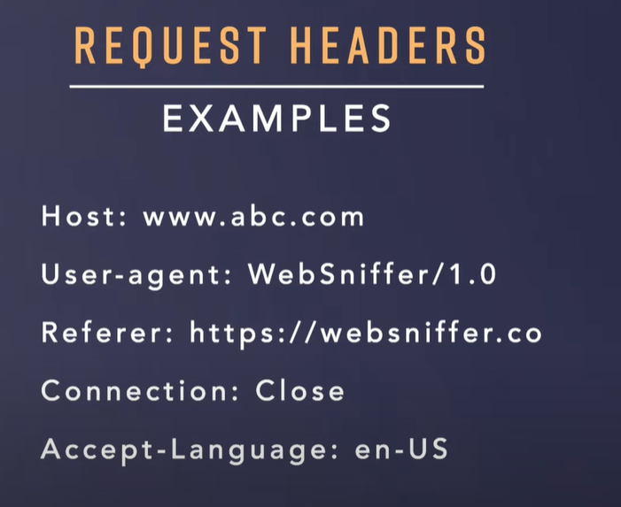
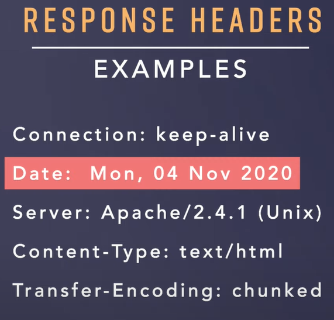

API --> Transfer data from one machine to another machine 
-> Piece of Info in form of Envelope 

Envelope -> to Address || From Address -> Headers  (metadata for Request and Response)
Headers -> Request Headers -> Key: Value Pairs 
         
                Content-Type is not a request header but Represntation headers
        
        -> Response Headers
                Addition info about the data being sent

        -> Payloads Headers
        -> Represntation Headers